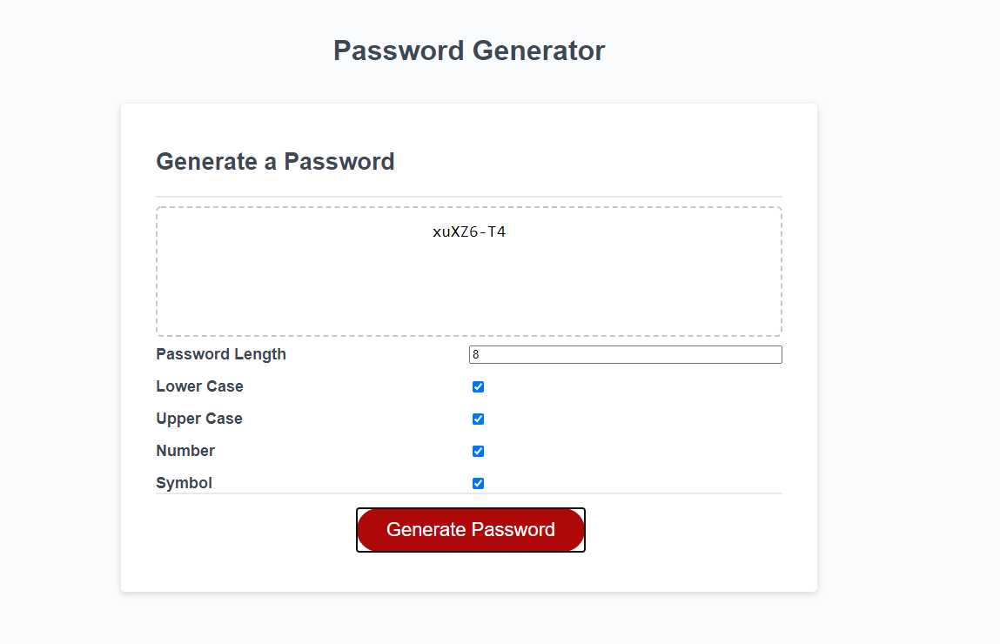

# Password Generator
Thsi repository contains a web application to automatically generate a password using a user's input. The user inputs the password length (limited to 8-128 characters) and whether they want the password to have lowercase, uppercase, numbers, and special characters. 

## Submission Links
Repository URL: [https://github.com/melissa-tan/password-generator](https://github.com/melissa-tan/password-generator)

Website URL: [https://melissa-tan.github.io/password-generator/](https://melissa-tan.github.io/password-generator/)

## Screenshot
The below image shows the Password Generator Web Application.

### Submission Requirements
- User is prompted to select password criterias
- Password is limited to at least 8 characters and no more than 128 characters
- Password criteria includes lowercase, uppercase, numeric, and/or special characters
- Password generator checks whether a criteria was selected or not
- Password is generated to match the selected criteria
- Password is shown on the page
